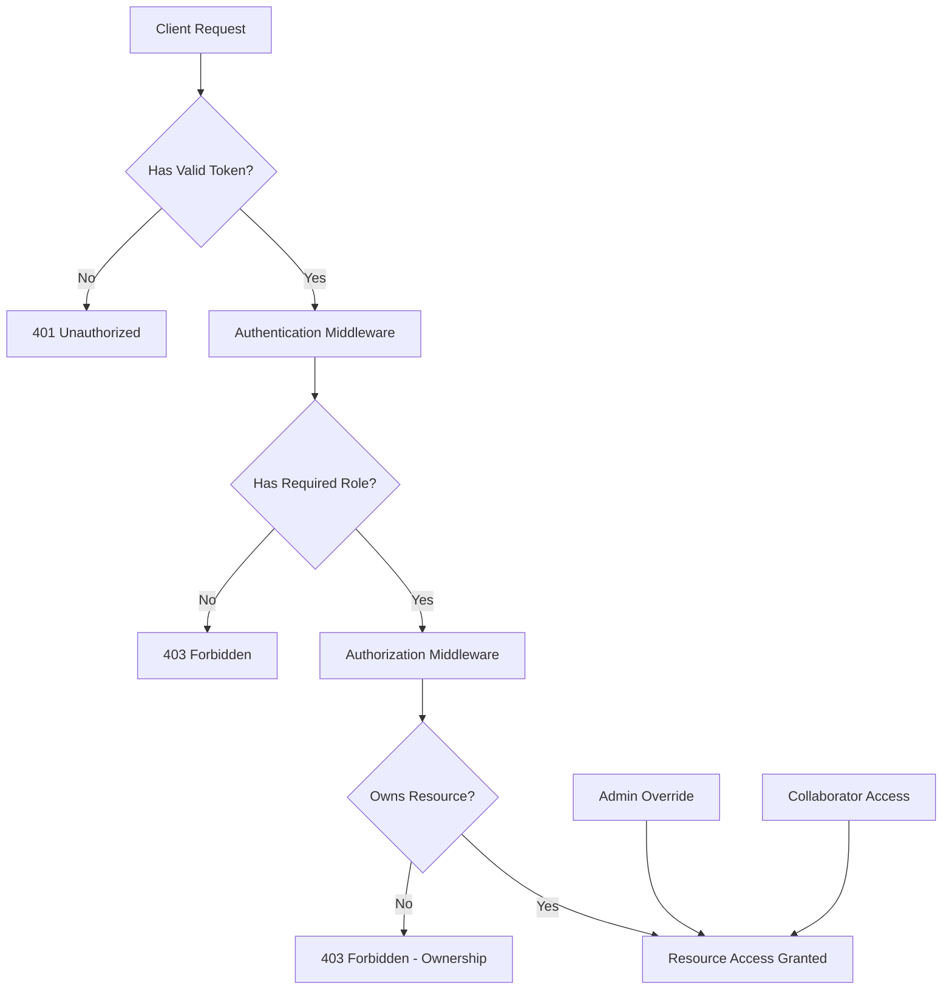

# 🔐 AlignME Authentication & Authorization System

## Overview

The AlignME platform implements a comprehensive three-layer security system:

1. **Authentication** - JWT-based token verification
2. **Authorization** - Role-based access control (RBAC)
3. **Ownership Verification** - Resource-level access control

## Table of Contents

- [🔐 AlignME Authentication \& Authorization System](#-alignme-authentication--authorization-system)
  - [Overview](#overview)
  - [Table of Contents](#table-of-contents)
  - [System Architecture](#system-architecture)
  - [Authentication Layer](#authentication-layer)
    - [JWT Token Structure](#jwt-token-structure)
    - [Token Types](#token-types)
    - [Implementation](#implementation)
  - [Authorization Layer](#authorization-layer)
    - [Role-Based Access Control](#role-based-access-control)
    - [Permission System](#permission-system)
    - [Implementation](#implementation-1)
  - [Ownership Verification Layer](#ownership-verification-layer)
    - [Resource Types](#resource-types)
    - [Access Patterns](#access-patterns)
    - [Implementation](#implementation-2)
  - [API Routes Security](#api-routes-security)
    - [Portfolio Routes](#portfolio-routes)
    - [Project Routes](#project-routes)
    - [Collaboration Management](#collaboration-management)
  - [Security Features](#security-features)
  - [Testing](#testing)
  - [Usage Examples](#usage-examples)
  - [Error Handling](#error-handling)
  - [Best Practices](#best-practices)
  - [Configuration](#configuration)
  - [Troubleshooting](#troubleshooting)

## System Architecture



## Authentication Layer

### JWT Token Structure

```javascript
// Access Token Payload
{
  userId: "user_123456789",
  email: "user@alignme.com",
  role: "seeker",
  permissions: ["read:profile", "update:profile"],
  iat: 1704067200,
  exp: 1704070800, // 1 hour expiration
  type: "access"
}

// Refresh Token Payload
{
  userId: "user_123456789",
  iat: 1704067200,
  exp: 1711843200, // 3 months expiration
  type: "refresh"
}
```

### Token Types

| Token Type | Purpose | Expiration | Storage |
|------------|---------|------------|---------|
| **Access Token** | API authentication | 1 hour | Memory/SessionStorage |
| **Refresh Token** | Token renewal | 3 months | HttpOnly Cookie |

### Implementation

```javascript
// Generate tokens
const accessToken = AuthMiddleware.generateAccessToken(user);
const refreshToken = AuthMiddleware.generateRefreshToken(user.id);

// Verify tokens
const payload = AuthMiddleware.verifyAccessToken(token);
const refreshPayload = AuthMiddleware.verifyRefreshToken(refreshToken);

// Use authentication middleware
app.use('/api/secure', AuthMiddleware.authenticate);
```

## Authorization Layer

### Role-Based Access Control

| Role | Description | Level | Default Permissions |
|------|-------------|-------|-------------------|
| **Admin** | System administrators | 5 | All permissions |
| **Moderator** | Content moderators | 4 | User management, content moderation |
| **Employer** | Company representatives | 3 | Job posting, candidate viewing |
| **Seeker** | Job seekers | 2 | Profile management, application |
| **Guest** | Unregistered users | 1 | View public content |

### Permission System

```javascript
// Permission categories
const Permission = {
  // Profile permissions
  READ_PROFILE: 'read:profile',
  UPDATE_PROFILE: 'update:profile',
  DELETE_PROFILE: 'delete:profile',
  
  // Portfolio permissions
  CREATE_PORTFOLIO: 'create:portfolio',
  UPDATE_PORTFOLIO: 'update:portfolio',
  DELETE_PORTFOLIO: 'delete:portfolio',
  
  // Project permissions
  CREATE_PROJECT: 'create:project',
  UPDATE_PROJECT: 'update:project',
  DELETE_PROJECT: 'delete:project',
  MANAGE_PROJECT: 'manage:project',
  
  // Collaboration permissions
  INVITE_COLLABORATORS: 'invite:collaborators',
  MANAGE_COLLABORATORS: 'manage:collaborators',
  
  // Administrative permissions
  MANAGE_USERS: 'manage:users',
  MODERATE_CONTENT: 'moderate:content',
  VIEW_ANALYTICS: 'view:analytics'
};

// Role-permission mapping
const rolePermissions = {
  admin: Object.values(Permission),
  moderator: [
    Permission.READ_PROFILE,
    Permission.MODERATE_CONTENT,
    Permission.VIEW_ANALYTICS,
    Permission.MANAGE_USERS
  ],
  employer: [
    Permission.READ_PROFILE,
    Permission.UPDATE_PROFILE,
    Permission.CREATE_PORTFOLIO,
    Permission.UPDATE_PORTFOLIO,
    Permission.DELETE_PORTFOLIO,
    Permission.CREATE_PROJECT,
    Permission.UPDATE_PROJECT,
    Permission.DELETE_PROJECT,
    Permission.MANAGE_PROJECT,
    Permission.INVITE_COLLABORATORS,
    Permission.MANAGE_COLLABORATORS
  ],
  seeker: [
    Permission.READ_PROFILE,
    Permission.UPDATE_PROFILE,
    Permission.CREATE_PORTFOLIO,
    Permission.UPDATE_PORTFOLIO,
    Permission.DELETE_PORTFOLIO,
    Permission.CREATE_PROJECT,
    Permission.UPDATE_PROJECT,
    Permission.DELETE_PROJECT
  ],
  guest: [
    Permission.READ_PROFILE
  ]
};
```

### Implementation

```javascript
// Basic role authorization
app.get('/api/admin-only', 
  AuthMiddleware.authenticate,
  AuthMiddleware.authorize(['admin']),
  (req, res) => {
    // Admin-only endpoint
  }
);

// Permission-based authorization
app.post('/api/portfolios',
  AuthMiddleware.authenticate,
  AuthMiddleware.authorizeWithPermissions(['seeker', 'employer'], ['create:portfolio']),
  (req, res) => {
    // Create portfolio endpoint
  }
);
```

## Ownership Verification Layer

### Resource Types

| Resource | Owner Field | Collaboration Support | Admin Override |
|----------|-------------|----------------------|----------------|
| **Portfolio** | `userId` | No | Yes |
| **Project** | `portfolio.userId` | Yes | Yes |
| **Profile** | `id` | No | Yes |

### Access Patterns

```javascript
// Project access hierarchy
1. Project Owner (portfolio.userId === user.id)
2. Active Collaborator (collaboration.status === 'active' && has required permissions)
3. Admin Override (user.role === 'admin' && allowAdmins === true)
```

### Implementation

```javascript
// Project ownership verification
app.put('/api/projects/:id',
  AuthMiddleware.authenticate,
  AuthMiddleware.authorize(['seeker', 'employer']),
  verifyProjectOwnership({ 
    allowCollaborators: true, 
    requiredPermission: 'edit',
    allowAdmins: true 
  }),
  (req, res) => {
    // Update project endpoint
  }
);

// Portfolio ownership verification
app.delete('/api/portfolios/:id',
  AuthMiddleware.authenticate,
  AuthMiddleware.authorize(['seeker', 'employer']),
  verifyPortfolioOwnership({ allowAdmins: true }),
  (req, res) => {
    // Delete portfolio endpoint
  }
);
```

## API Routes Security

### Portfolio Routes

```javascript
// Portfolio CRUD operations
POST   /api/portfolios                    // Create portfolio
GET    /api/portfolios/:id               // Get portfolio (public)
PUT    /api/portfolios/:id               // Update portfolio (owner only)
DELETE /api/portfolios/:id               // Delete portfolio (owner only)

// Project management within portfolios
POST   /api/portfolios/:id/projects      // Create project in portfolio
GET    /api/portfolios/:id/projects      // List projects in portfolio
```

### Project Routes

```javascript
// Project operations
PUT    /api/projects/:id                 // Update project (owner/collaborator)
DELETE /api/projects/:id                 // Delete project (owner only)

// Collaboration management
POST   /api/projects/:id/collaborators                    // Add collaborator
GET    /api/projects/:id/collaborators                    // List collaborators
PUT    /api/projects/:id/collaborators/:userId           // Update permissions
DELETE /api/projects/:id/collaborators/:userId           // Remove collaborator
```

### Collaboration Management

```javascript
// Collaborator permissions
const collaboratorPermissions = {
  owner: ['view', 'comment', 'edit', 'manage', 'admin'],
  manager: ['view', 'comment', 'edit', 'manage'],
  developer: ['view', 'comment', 'edit'],
  reviewer: ['view', 'comment'],
  viewer: ['view']
};

// Permission requirements by action
const actionPermissions = {
  GET: 'view',
  PUT: 'edit',
  DELETE: 'admin',
  POST: 'manage' // For adding resources
};
```

## Security Features

### 🔒 Token Security
- JWT with HS256 signing
- Short-lived access tokens (1 hour)
- Refresh token rotation
- Token blacklisting support

### 🛡️ Request Protection
- Rate limiting on auth endpoints
- CORS configuration
- Helmet.js security headers
- Input validation and sanitization

### 🔐 Password Security
- bcrypt hashing (12 rounds)
- Password history tracking
- Failed login attempt tracking
- Account lockout protection

### 📊 Audit Logging
- Authentication attempts
- Authorization failures
- Resource access patterns
- Security events

## Testing

### Unit Tests
```bash
npm test src/tests/auth-security.test.js
```

### Integration Tests
```bash
npm test src/tests/api-integration.test.js
```

### Coverage Areas
- ✅ JWT token generation/verification
- ✅ Authentication middleware
- ✅ Role-based authorization
- ✅ Ownership verification
- ✅ API endpoint security
- ✅ Error handling
- ✅ Collaborator permissions

## Usage Examples

### 1. Basic Authentication

```javascript
// Client-side token usage
const response = await fetch('/api/portfolios', {
  method: 'POST',
  headers: {
    'Authorization': `Bearer ${accessToken}`,
    'Content-Type': 'application/json'
  },
  body: JSON.stringify({
    title: 'My Portfolio',
    description: 'Portfolio description',
    visibility: 'public'
  })
});
```

### 2. Role-Based Access

```javascript
// Middleware usage for different roles
const adminOnly = [
  AuthMiddleware.authenticate,
  AuthMiddleware.authorize(['admin'])
];

const employerOrAdmin = [
  AuthMiddleware.authenticate,
  AuthMiddleware.authorize(['employer', 'admin'])
];

app.get('/api/admin/analytics', ...adminOnly, analyticsController);
app.post('/api/jobs', ...employerOrAdmin, createJobController);
```

### 3. Resource Ownership

```javascript
// Project update with ownership verification
app.put('/api/projects/:id', [
  AuthMiddleware.authenticate,
  AuthMiddleware.authorize(['seeker', 'employer']),
  verifyProjectOwnership({ 
    allowCollaborators: true, 
    requiredPermission: 'edit' 
  })
], async (req, res) => {
  try {
    const project = await PortfolioService.updateProject(
      req.params.id,
      req.body,
      req.user.id
    );
    
    res.json({
      success: true,
      project,
      message: 'Project updated successfully'
    });
  } catch (error) {
    res.status(500).json({
      success: false,
      error: error.message
    });
  }
});
```

## Error Handling

### Authentication Errors

```javascript
// 401 Unauthorized
{
  success: false,
  error: "Access token required",
  code: "NO_TOKEN"
}

{
  success: false,
  error: "Invalid or expired access token",
  code: "INVALID_TOKEN"
}

{
  success: false,
  error: "User not found or inactive",
  code: "USER_INACTIVE"
}
```

### Authorization Errors

```javascript
// 403 Forbidden
{
  success: false,
  error: "Access denied. Required role: admin",
  code: "INSUFFICIENT_PERMISSIONS"
}

{
  success: false,
  error: "Access denied. Insufficient permissions.",
  code: "INSUFFICIENT_PERMISSIONS",
  required: ["manage:users"]
}
```

### Ownership Errors

```javascript
// 403 Forbidden - Ownership
{
  success: false,
  message: "Access denied - you can only modify your own projects or projects you collaborate on",
  code: "PROJECT_OWNERSHIP_REQUIRED"
}

// 404 Not Found
{
  success: false,
  message: "Project not found",
  code: "PROJECT_NOT_FOUND"
}
```

## Best Practices

### 🔑 Token Management
- Store access tokens in memory or sessionStorage
- Use httpOnly cookies for refresh tokens
- Implement automatic token refresh
- Clear tokens on logout

### 🛡️ Middleware Chain Order
1. **CORS** - Cross-origin configuration
2. **Helmet** - Security headers
3. **Rate Limiting** - Request throttling
4. **Authentication** - Token verification
5. **Authorization** - Role/permission check
6. **Ownership** - Resource access verification
7. **Business Logic** - Application logic

### 📝 Logging and Monitoring
- Log all authentication failures
- Monitor suspicious access patterns
- Track permission escalation attempts
- Alert on multiple failed attempts

### 🔄 Error Responses
- Never expose internal system details
- Use consistent error response format
- Provide helpful error codes
- Log detailed errors server-side

## Configuration

### Environment Variables

```bash
# JWT Configuration
JWT_ACCESS_SECRET=your-super-secret-access-key
JWT_REFRESH_SECRET=your-super-secret-refresh-key
JWT_ACCESS_EXPIRES=1h
JWT_REFRESH_EXPIRES=3M

# Security Configuration
BCRYPT_ROUNDS=12
MAX_LOGIN_ATTEMPTS=5
LOCKOUT_DURATION=15m
SESSION_TIMEOUT=24h

# Rate Limiting
AUTH_RATE_LIMIT=5
AUTH_RATE_WINDOW=15m
API_RATE_LIMIT=100
API_RATE_WINDOW=1h
```

### Middleware Configuration

```javascript
// auth.js configuration
const authConfig = {
  tokenExpiration: {
    access: '1h',
    refresh: '3M'
  },
  security: {
    allowRefreshRotation: true,
    enableBlacklist: true,
    requireEmailVerification: true
  },
  logging: {
    logFailedAttempts: true,
    logSuccessfulLogins: false,
    logTokenRefresh: true
  }
};
```

## Troubleshooting

### Common Issues

#### 1. Token Expiration
**Problem**: API calls return 401 after some time
**Solution**: Implement automatic token refresh

```javascript
// Auto-refresh implementation
const refreshToken = async () => {
  const response = await fetch('/api/auth/refresh', {
    method: 'POST',
    credentials: 'include' // Include httpOnly cookie
  });
  
  if (response.ok) {
    const { accessToken } = await response.json();
    localStorage.setItem('accessToken', accessToken);
    return accessToken;
  }
  
  // Redirect to login if refresh fails
  window.location.href = '/login';
};
```

#### 2. Role Permission Issues
**Problem**: User has correct role but permission denied
**Solution**: Check role-permission mapping

```javascript
// Debug permissions
console.log('User role:', req.user.role);
console.log('User permissions:', req.user.permissions);
console.log('Required permissions:', requiredPermissions);
```

#### 3. Ownership Verification Failures
**Problem**: Owner cannot access their own resources
**Solution**: Verify ownership middleware configuration

```javascript
// Debug ownership
console.log('User ID:', req.user.id);
console.log('Resource owner:', resource.userId);
console.log('Is owner:', resource.userId === req.user.id);
```

### Performance Optimization

#### 1. Database Queries
- Use proper indexes on userId fields
- Implement query result caching
- Use database connection pooling

#### 2. Token Verification
- Cache JWT verification results
- Use Redis for token blacklisting
- Implement token validation middleware early

#### 3. Ownership Checks
- Implement resource-level caching
- Batch ownership verification queries
- Use database views for complex ownership

---

## 📞 Support

For questions or issues with the authentication system:

1. Check the troubleshooting section above
2. Review the test files for usage examples
3. Examine the middleware source code
4. Contact the AlignME development team

---

**Security Notice**: This authentication system is designed for production use with proper configuration. Ensure all environment variables are set correctly and secrets are properly secured.

## Version History

- **v2.0.0** - Complete JWT + RBAC + Ownership system
- **v1.5.0** - Added collaboration support
- **v1.0.0** - Initial JWT authentication
